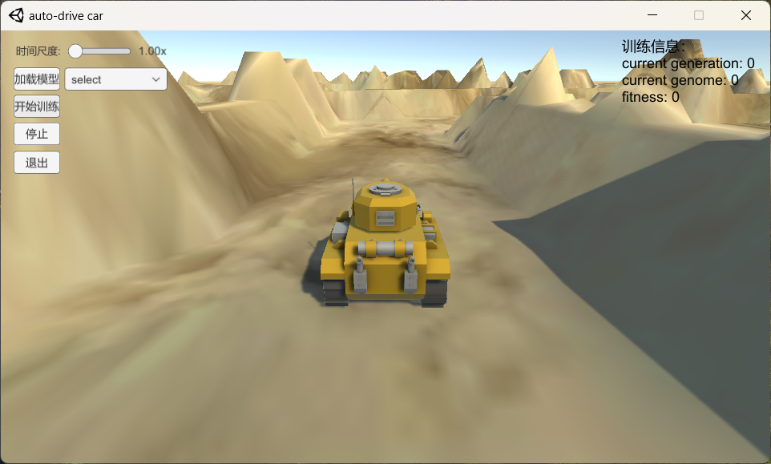

# 基于遗传算法的自动驾驶小车

## 项目介绍

该算法内容参考youtube大神的视频，视频原地址为：

[🚗 Neural Networks and Genetic Algorithms for a Self Driving Car in Unity - 1](https://m.youtube.com/watch?v=VYQZ-kjP1ec)

视频搬运bilibili地址为：

[基于遗传算法的神经网络自动驾驶小车](https://space.bilibili.com/438671228/channel/seriesdetail?sid=2071987&ctype=0)

项目的最终效果：

加载小车模型

训练小车模型

## 项目软件及版本

VS2019， Unity2019

## 使用方法

### 1. 加载模型

可以加载已经预训练好的模型，选择模型，然后点击加载模型小车就会自动进行驾驶。

### 2. 训练模型

点击开始训练，进入训练环节，右上角**current generation**表示训练的代数，**current genome**表示当前代中训练的第几个个体，**fitness**表示该个体当前对于环境的适应值。

单击停止停止训练，当模型的fitness超出1000表示模型已经训练成功，会自动根据当前时间命名模型并保存，模型的保存路径为：*\auto-drive car_Data\StreamingAssets。*
